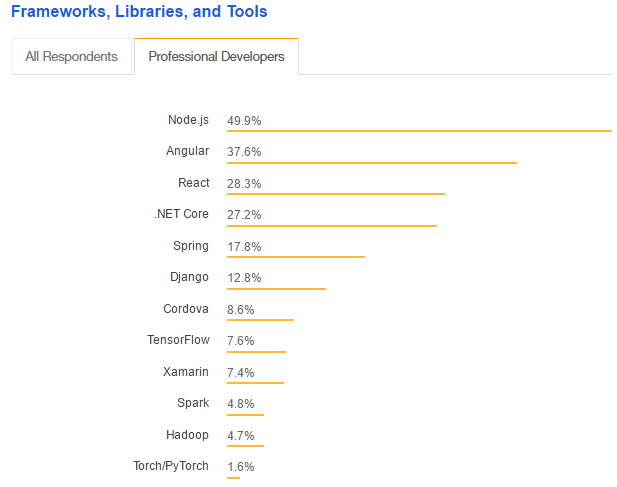

# Javascript (JS) with Node.js on Linux (Arch)


 -- Using Server-Side JS.

>Is Node.js still relevant for 2019?

>Among the top ten most in-demand jobs, the number of job opportunities for Node.JS developers alone has raised by around 2500%.

>With early adopters such as LinkedIn, Paypal and other tech companies, Node.JS has seen an exponential increase in it’s usage in web development.

>In fact, Netflix is the best instance who leveraged the benefits offered by Node.JS by implementing it for production. Did you know using Node.JS, Netflix changed from a 40 minute + startup time to less than a minute?

>Clearly, Node.JS is in great demand that is definitely higher than the rest of similar tools/ technologies. As a matter of fact, Node.JS is the most popularly used technology among professional developers as per the survey results by Stack Overflow developers report 2018.



Image source: Stack Overflow developers survey report 2018

[Quote source](https://www.quora.com/Is-Node-js-still-relevant-for-2019#ans148013543)

Note:
It was itching me since a while to try hybrid Frameworks that enable you write code which can be executed in a browser, as a mobile app and desktop app like (React Native, Flutter, Ionic, Framework 7 or PhoneGap). I hope I find some time to look into them.


## Javascript (JS)

-- The Language

Until today, alongside HTML and CSS, JS is one of the three core technologies of World Wide Web content production.

Like most programming languages there are more flavors of JS, like TypeScript. To control the core of the language it is standardized as ECMAScript (or ES) by Ecma International in ECMA-262 and ISO/IEC 16262.


## Node.js

-- The Runtime

Check https://wiki.archlinux.org/index.php/Node.js for the installation.
Node.js is one runtime environent for JS, its interpreter makes the execution of scripts possible.


## Server Side Framework

[Electron Framework](https://electronjs.org/) is one Framework to build Server-side Applications.


## NPM

-- The Package Manager

It is the default package manager for the JavaScript runtime environment Node.js. On Arch it is also in the repos. Like in most programming languages you can't do much without installing additional packages.


## IDE

After using NetBrains PyCharm for my Python Code and WebStorm isn't entirley free, I gave Microsofts Visual Studio Code (VSC) another shot. Another reason why I decided to move away for now from NetBrains products is that CLion doesn't really work that way for me in C I want.

I am used to the fact that most of the IDE's are bloated nowdays, but being paralized while IDE's are indexing is one of the most annoying things I ever encountered. You are in a working flow and software decides to force an interruption, you feel ported back into the good old windows times, when windows decided to reboot your machine.

After using Atom for a while, which is very slow in execution, I hope that VSC has higher code quality. Both pieces of software are using the Electron Framework, I don't think that electron is the one to blame but one should never predict, right?.

To install VSC on Arch-Linux there is not much to do, it is in the official repositories and a simple `sudo pacman -S code` will do it.

To execute VSC run `code` from your Shell or find it in your graphical Desktop-Environment.

On the Welcome Screen on the right side under Customize the next paragraph is Tools and Languages, click on Javascript to add support for it.


## First contact

Paste the node.js "Hello World" to VSC:

```js
var msg = 'Hello World';
console.log(msg);
```

name it `njs_hw.js` and execute it via VSC's integrated terminal:
`node njs_hw.js`

See also:
<https://code.visualstudio.com/docs/nodejs/nodejs-tutorial>


## Electron Hello World

- Using Chromium as Renderer Backend

Not reinventing the wheel here too, there is a lot of boilerplate code in:

<https://github.com/electron/electron-quick-start>

Applications using Electron are structured:

The application description and metadata in `json` format:

`package.json`

`main.js`
The purpose of the JS file should be clear, this is where the code goes.

The `index.html`, will be the shown/viewed content.

```js
function createWindow () {
  // Create the browser window.
  mainWindow = new BrowserWindow({
    width: 800,
    height: 600,
    webPreferences: {
      preload: path.join(__dirname, 'preload.js')
    }
  })
```

The function preloads a script to evaluate the version variables.

Execute the code with `electron .`.

Postloading can be done in `index.html`

```html
<script src="./some_script.js"></script>
```


## GTK Hello World

Since we have running a sane JS developing environment now, we can use most kinds of provided packages now and setting up a GTK-Application boilerplate can't hurt.

JS is an official [GNOME Binding](https://www.gtk.org/language-bindings.php). `Gjs` is a JS binding for GNOME and it is in the Repositories.

Paste the hello-world.js from https://developer.gnome.org/gnome-devel-demos/stable/hello-world.js.html.en to VSC and use `gjs hw.js` to execute the code.


## Reflecting VSC's behaviour

**Autosave**
I don't like that you have to save files every time in contrast to PyCharm.
Check `File/Auto Save` to fix that.

The meta key for cursor movement is `ctrl` like in many other software projects, unlike `alt` in Bash's readline.

Key bindings you may want to adjust:

-The commands can be looked up to identify the action.

**Duplicate Line**
editor.action.copyLinesDownAction

**Toggle Comment**
editor.action.commentLine

**Kill Line**
editor.action.deleteLines

